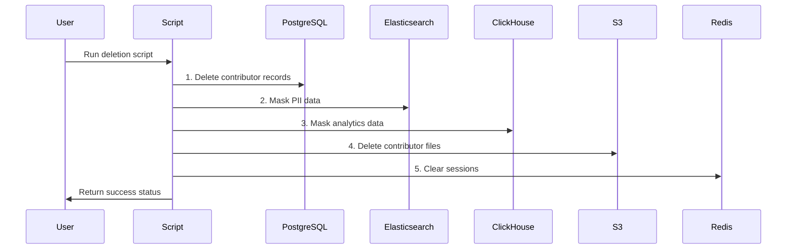

# System Architecture

## Contributor Deletion System Architecture

```mermaid
graph TB
    A[CSV Input File] --> B[Contributor Deletion System]
    
    B --> C[PostgreSQL Database]
    B --> D[Elasticsearch]
    B --> E[ClickHouse]
    B --> F[S3 Storage]
    B --> G[Redis Cache]
    
    C --> C1[kepler_crowd_contributors_t]
    C --> C2[kepler_crowd_contributor_job_mapping_t]
    C --> C3[kepler_crowd_contributors_project_stats_t]
    C --> C4[Other contributor tables]
    
    D --> D1[project-* indices]
    D --> D2[Unit View Data]
    D --> D3[Judgment View Data]
    
    E --> E1[kepler.unit_metrics]
    E --> E2[kepler.unit_metrics_hourly]
    E --> E3[kepler.accrued_contributor_stats]
    
    F --> F1[Contributor Files]
    F --> F2[Uploaded Data]
    
    G --> G1[Session Data]
    G --> G2[Authentication Cache]
    G --> G3[Job Assignment Cache]
    
    B --> H[Output: Masked Data]
    H --> H1[DELETED_USER in PostgreSQL]
    H --> H2[DELETED_USER in Elasticsearch]
    H --> H3[DELETED_USER in ClickHouse]
    H --> H4[Cleared Redis Sessions]
    H --> H5[Deleted S3 Files]
```

## Data Flow Diagram

## Component Overview

### Core Scripts
- **delete_contributors_csv.py**: Main deletion script
- **fetch_inactive_contributors.py**: Data fetching script
- **test_fetch_commit_apis.py**: API testing script

### Workflow Scripts
- **comprehensive_testing_workflow.py**: Complete end-to-end workflow
- **run_deletion.py**: Simple deletion runner
- **run_deletion.sh**: Shell script wrapper

### Data Processing Scripts
- **manual_elasticsearch_masking.py**: Manual ES masking
- **manual_clickhouse_masking.py**: Manual ClickHouse masking
- **unified_unit_routing_and_testing_script.py**: Unit routing automation

## System Components

### PostgreSQL (Source of Truth)
- **Purpose**: Primary database storing contributor information
- **Operations**: Delete records, mask PII data
- **Key Tables**: 
  - `kepler_crowd_contributors_t` (main table)
  - `kepler_crowd_contributor_job_mapping_t` (job mappings)
  - `kepler_crowd_contributors_project_stats_t` (project stats)

### Elasticsearch (User-Facing Data)
- **Purpose**: Search and analytics engine for Unit View and Judgment View
- **Operations**: Mask email addresses and worker IDs
- **Key Indices**: `project-*` (contains unit view data)
- **Masking**: Replace with "DELETED_USER"

### ClickHouse (Analytics & Reporting)
- **Purpose**: Analytics database for reporting and metrics
- **Operations**: Mask email addresses (contributor_id is key column, cannot be updated)
- **Key Tables**:
  - `kepler.unit_metrics`
  - `kepler.unit_metrics_hourly`
  - `kepler.accrued_contributor_stats`

### S3 (File Storage)
- **Purpose**: Object storage for contributor files and data
- **Operations**: Delete files containing contributor IDs
- **Scope**: Files with contributor-specific data

### Redis (Session Management)
- **Purpose**: Caching and session storage
- **Operations**: Clear authentication and session data
- **Scope**: Contributor-specific cache entries

## Safety Features

### Dry Run Mode
- All scripts support `--dry-run` flag
- Shows what would be deleted without actually performing operations
- Safe for testing and validation

### Comprehensive Logging
- Detailed logs with timestamps
- Operation tracking and error reporting
- Audit trail for compliance

### Backup Creation
- Automatic CSV backups before deletion
- Contributor data preservation for recovery
- Timestamped backup files

### Error Handling
- Graceful failure handling
- Transaction rollback on errors
- Continue processing other contributors on individual failures

## Integration Points

### Environment Support
- **Development**: Local databases and services
- **Integration**: Kubernetes-based services with port-forwarding
- **Production**: Full production environment support

### Configuration Management
- Environment-specific configuration files
- Secure credential management
- Flexible connection parameters

### Monitoring and Verification
- Post-deletion verification scripts
- Data integrity checks
- Success/failure reporting
