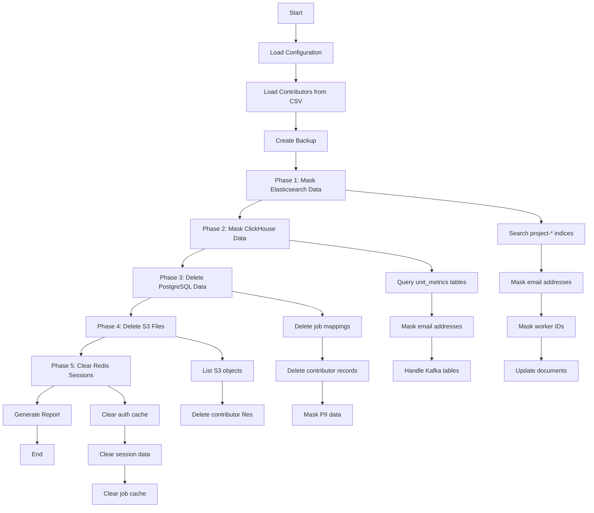
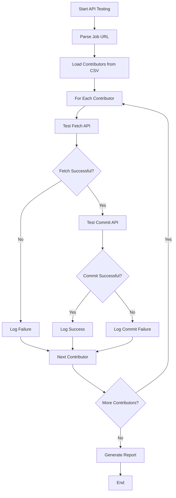
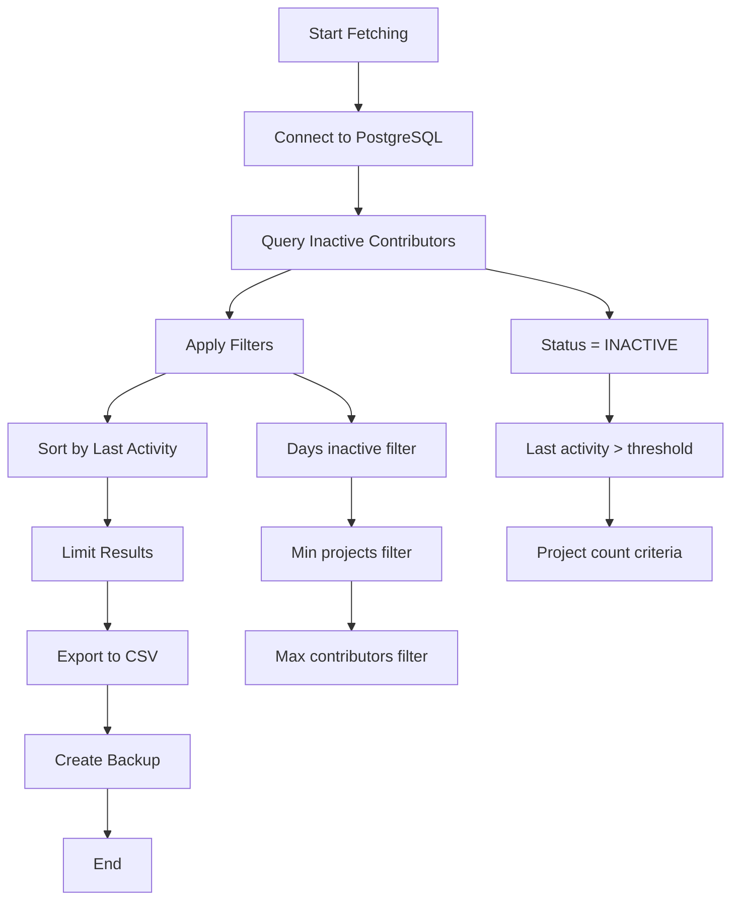
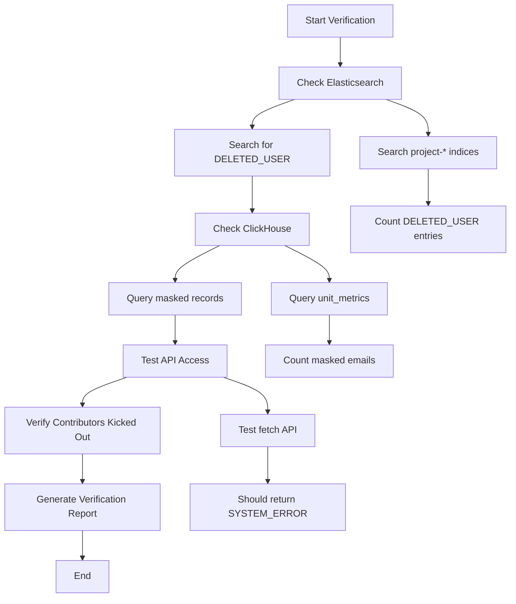
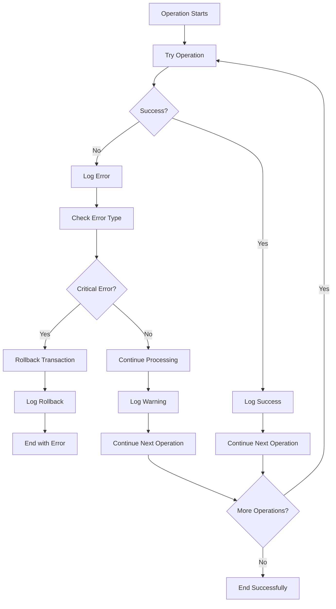
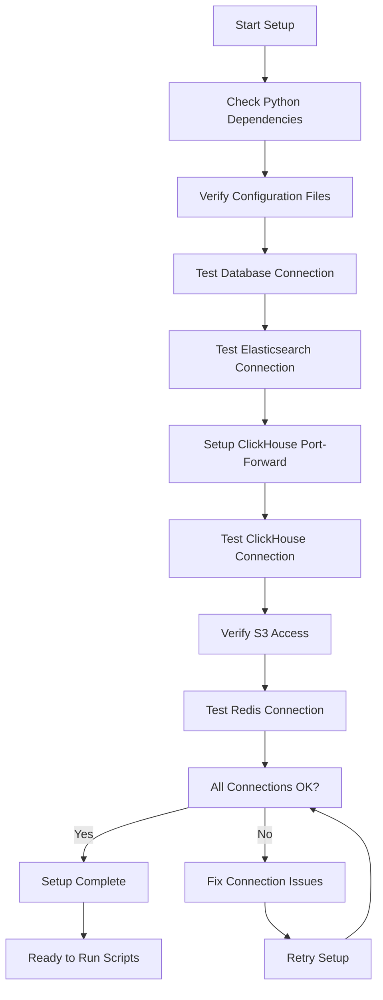
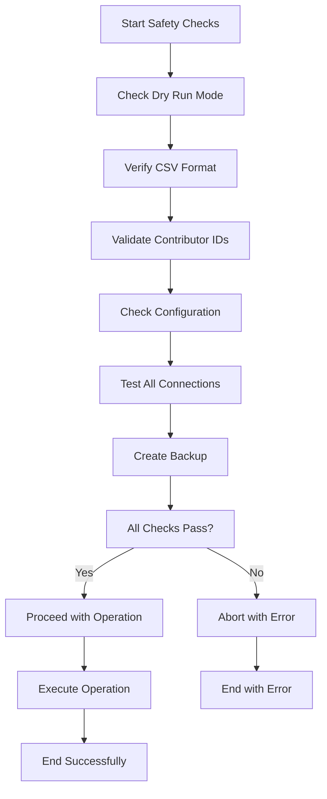

# Workflow Diagrams

## Complete Contributor Deletion Workflow

## API Testing Workflow

## Data Fetching Workflow

## Verification Workflow

## Error Handling Workflow

## Environment Setup Workflow

## Safety Checks Workflow

